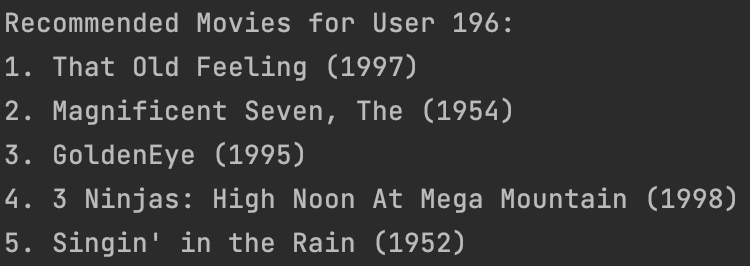
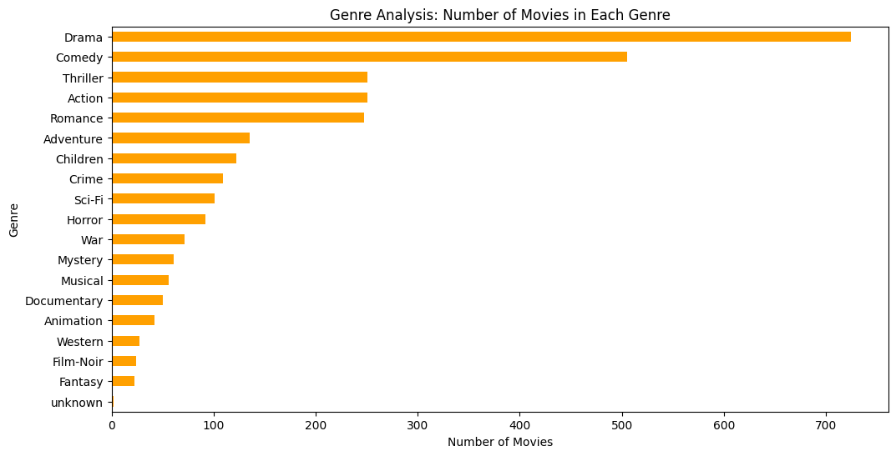
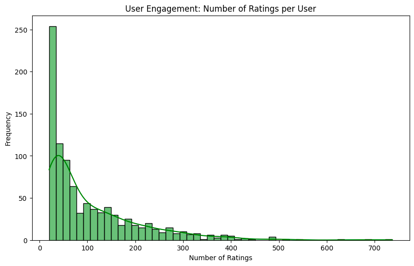
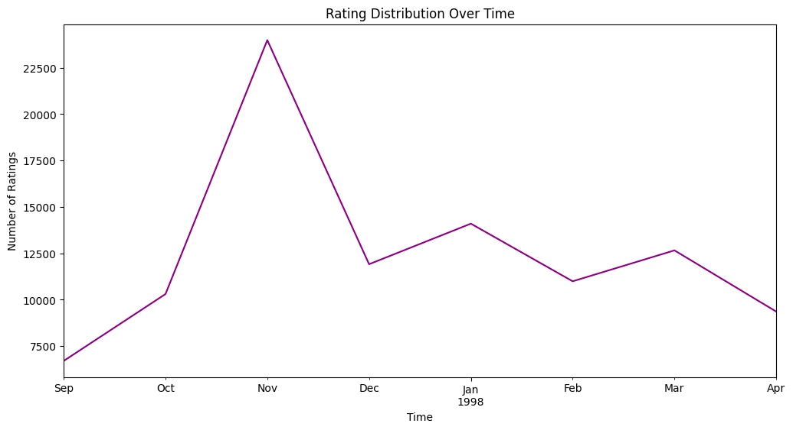
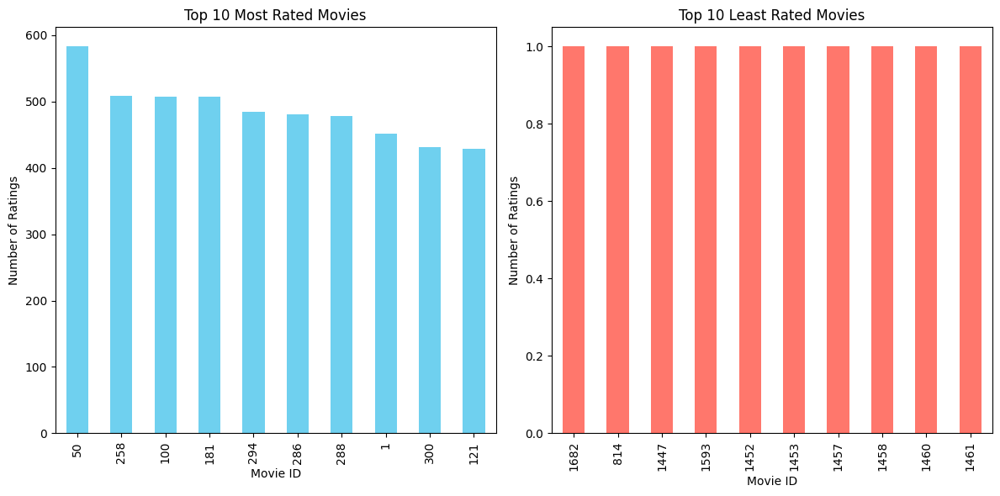

# Movie Recommendation System Report

## Execution

### Training
   - ```python3 models/training.py```
### See what model does
   - ```python3 benchmark/benchmark.py```

## Introduction

This report discusses the implementation and evaluation of a movie recommendation system using matrix factorization. The
model is trained on user-movie interaction data to predict user ratings for movies. The report covers the data analysis,
model implementation, training process, evaluation, and results.

## Data Analysis

### Dataset Overview

The dataset used for training and testing the movie recommendation system consists of user-movie interaction data. Here
is an overview of the dataset:

- Number of distinct users: 943
- Number of distinct movies: 1682
- The complete rating matrix consists of: 1,586,126 elements.
- Total number of ratings recorded: 100,000

The user-movie interaction matrix is sparsely populated, with approximately 6.30% of the matrix being filled. This
sparsity indicates that users have provided ratings for a subset of the available movies, and the recommendation system
aims to predict ratings for the remaining, unseen movies.

## Model Implementation

### Matrix Factorization Model

The MatrixFactorization model is employed for the recommendation system. This model utilizes a collaborative filtering
approach to capture latent factors (embeddings) of both users and items (movies). The collaborative filtering technique
is based on the idea that users who have agreed in the past tend to agree again in the future.

#### User and Item Embeddings

- **User Embeddings:** Represent users in a lower-dimensional space, capturing user preferences and behavior patterns.
- **Item Embeddings:** Represent items (movies) in the same lower-dimensional space, capturing their characteristics.

#### Architecture

- The model is structured as a torch.nn.Module in PyTorch.
- User and item embeddings are created as lookup tables, allowing the model to learn relationships between users and
  items.
- Embeddings are initialized with small random values to start training.
- The forward method of the model performs matrix multiplication of user and item embeddings, providing predictions for
  user-item interactions.

### Data Loader

The DataLoader class is utilized to efficiently load and process training and testing data for the MatrixFactorization
model. It plays a crucial role in mapping continuous indices for users and movies.

#### Mapping Indices

- The initialization method of DataLoader sets up data structures for mapping between original user and movie IDs and
  continuous indices.
- Unique user and movie IDs are extracted from the dataset.
- New continuous indices are assigned to users and movies, and mappings are established.
- Original movie and user IDs in the dataset are replaced with continuous indices.

#### Transforming Data to PyTorch Tensors

- Features (x) and target ratings (y) are extracted for training.
- The data is transformed into PyTorch tensors, making it compatible with PyTorch models.
- The DataLoader returns a tuple of features and target ratings for a given index during training.

This collaborative approach leverages user-item interactions to learn latent factors and make personalized
recommendations.

## Model Advantages and Disadvantages

### Advantages of Matrix Factorization

1. **Personalization:** Matrix factorization allows for personalized recommendations by capturing user preferences and
   item characteristics in a lower-dimensional space. This enables the model to suggest items tailored to individual
   users.

2. **Implicit Feedback Handling:** The approach can handle implicit feedback, where user-item interactions are not
   explicitly rated but still contribute to learning patterns and preferences.

3. **Scalability:** Matrix factorization is computationally efficient, making it scalable to large datasets. It provides
   a good balance between model complexity and training efficiency.

4. **Interpretability:** Embeddings learned through matrix factorization have interpretability. The dimensions of the
   embedding space can represent meaningful features or characteristics of users and items.

### Disadvantages and Limitations

1. **Cold Start Problem:** Matrix factorization may face challenges when dealing with new users or items that have
   limited interaction history (cold start problem). It relies heavily on historical data for accurate predictions.

2. **Sparsity Issues:** In highly sparse matrices, where many user-item interactions are missing, the model's ability to
   generalize may be limited. Handling sparsity effectively remains a challenge.

3. **Lack of Contextual Information:** Matrix factorization does not explicitly consider contextual information such as
   user demographics or temporal dynamics. Incorporating additional context could enhance recommendation accuracy.

### Potential Areas for Improvement

1. **Hybrid Models:** Combining matrix factorization with other recommendation techniques, such as content-based
   filtering or deep learning, can address some limitations and improve overall performance.

2. **Incorporating Side Information:** Integrating side information, such as user demographics or item features, can
   enhance the model's ability to make accurate predictions, especially in the cold start scenario.

3. **Advanced Regularization Techniques:** Exploring advanced regularization techniques can help mitigate overfitting
   issues and improve the generalization of the model.

4. **Dynamic Embeddings:** Implementing dynamic embeddings that evolve over time can capture temporal patterns and adapt
   to changing user preferences.

Matrix factorization provides a solid foundation for collaborative filtering, but continuous research and innovation are
essential to address its inherent limitations and further enhance recommendation system capabilities.

## Training Process

### Training Parameters

The model is trained with the following parameters:

- Number of epochs: 128
- Learning rate: 1e-3
- Number of factors in embeddings: 8

### Loss Function and Optimization

The training employs the Mean Squared Error (MSE) loss function to measure the difference between predicted and actual
ratings. The ADAM optimizer is utilized to adjust model weights and minimize the loss during training.

### Training Progress

The training progress is visualized by plotting the loss over epochs. A decreasing trend in the loss indicates the model
is learning and improving its ability to make accurate predictions.

## Evaluation

### Testing Process

The model is evaluated on the test set to assess its performance. The evaluation process involves comparing the model's
predicted ratings with the actual ratings in the test set. This allows us to understand how well the model generalizes
to unseen data.

### Test Loss

The average test loss obtained during the evaluation process is 2.15. Lower test loss values indicate better predictive
performance, with the model making more accurate predictions on the test set.

Training Progress:

- Step: 127
- Loss: 0.54

The training process shows a decreasing loss trend, suggesting the model is effectively learning from the training data.
Further analysis of loss trends and convergence patterns may provide insights into the model's stability and
generalization ability.

## Results



# Figures

1. Figure: Number of Movies in Each Genre
   

2. Figure: Number of Ratings per User
   

3. Figure: Rating Distribution Over Time
   

4. Figure: Top 10 Least Rated Movies
   
